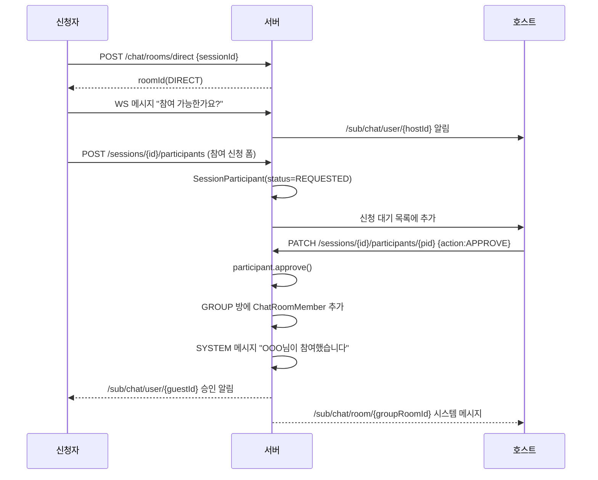

# Run-Spot 커뮤니티 · 채팅 백엔드 기능명세서

> 대상 도메인: `community`, `chat`, `file`
> 기준 코드베이스: `com.highpass.runspot` (Spring Boot 4.0.2 / Java 17 / JPA / MySQL RDS / Redis)
> 작성 기준: 첨부된 커뮤니티 4종 · 채팅 6종 화면

---

## 0. 전제 및 확인 필요 사항

| # | 항목 | 가정 | 확인 필요 |
|---|---|---|---|
| 1 | 러닝 코스 원본 데이터 | 기존 `running_records`(개인 러닝 기록) 테이블에 거리/평균페이스/경로 polyline/지도 썸네일 보관 | 실제 테이블명·경로 저장 방식(polyline vs GeoJSON) |
| 2 | 모집글 도메인 | 기존 `sessions` + `session_participants` 재사용 (신규 recruit 도메인 만들지 않음) | 채팅 화면의 "모집"이 곧 Session인지 |
| 3 | 인증 | JWT Bearer, `SecurityContext`에서 `userId` 추출 | 기존 세션 기반 인증이면 WebSocket 핸드셰이크 방식 변경 필요 |
| 4 | 서버 대수 | 단일 EC2 기준이나 Redis Pub/Sub 전제로 설계 (스케일아웃 대비) | — |

---

## 1. 공통 규약

### 1.1 응답 포맷

```json
{ "code": "SUCCESS", "message": "요청에 성공했습니다.", "data": { } }
```

### 1.2 페이지네이션

무한스크롤 화면(게시글 목록, 댓글, 채팅 메시지)은 **커서 기반**을 사용합니다. offset 방식은 새 글/새 메시지가 들어올 때 중복·누락이 발생합니다.

```
GET /api/v1/posts?cursor=1024&size=20
→ { "items": [...], "nextCursor": 1003, "hasNext": true }
```

- 정렬이 `LATEST`면 cursor = 마지막 아이템의 `id`
- 정렬이 `POPULAR`면 cursor = `{likeCount}_{id}` 복합 커서

### 1.3 패키지 구조

```
com.highpass.runspot
├── community
│   ├── domain      Post, PostImage, Comment, PostLike, PostScrap, Tag, Report
│   ├── repository
│   ├── service     PostService, CommentService, PostLikeService, ReportService
│   ├── controller
│   └── dto
├── chat
│   ├── domain      ChatRoom, ChatRoomMember, ChatMessage, ChatNotice
│   ├── repository
│   ├── service     ChatRoomService, ChatMessageService, ChatReadService
│   ├── controller  ChatController(REST), ChatStompController(WS)
│   ├── config      StompWebSocketConfig, StompHandler(인증 인터셉터)
│   └── dto
└── file
    ├── service     S3PresignService, FileCleanupScheduler
    └── controller  FileController
```

---

## 2. 커뮤니티 도메인

### 2.1 테이블 설계

#### `posts`

| 컬럼 | 타입 | 제약 | 설명 |
|---|---|---|---|
| id | BIGINT | PK, AUTO_INC | |
| user_id | BIGINT | FK(users), NOT NULL | 작성자 |
| board_type | VARCHAR(20) | NOT NULL | `GENERAL` / `COURSE` |
| title | VARCHAR(100) | NOT NULL | |
| content | TEXT | NOT NULL | |
| running_record_id | BIGINT | FK, NULL | `COURSE`일 때만 값 존재 |
| like_count | INT | DEFAULT 0 | 역정규화 카운터 |
| comment_count | INT | DEFAULT 0 | 역정규화 카운터 |
| view_count | INT | DEFAULT 0 | |
| status | VARCHAR(20) | NOT NULL | `PUBLISHED` / `DRAFT` / `DELETED` |
| created_at / updated_at | DATETIME | `BaseTimeEntity` | |

인덱스: `idx_posts_board_type_id (board_type, id DESC)`, `idx_posts_user_id`, `idx_posts_like_count (board_type, like_count DESC, id DESC)`

**제약**: `board_type = 'COURSE'`인데 `running_record_id`가 null이면 저장 거부 (`@PrePersist` 또는 서비스단 검증).

#### `post_images`

| 컬럼 | 타입 | 설명 |
|---|---|---|
| id | BIGINT | PK |
| post_id | BIGINT | FK(posts), ON DELETE CASCADE |
| image_key | VARCHAR(500) | S3 object key (URL 전체가 아닌 key만 저장) |
| sort_order | TINYINT | 0~2 |

`uk_post_images_post_order (post_id, sort_order)` — **최대 3장 제약은 서비스 레이어에서 검증**합니다. DB 제약만으로는 개수 제한이 안 되므로 `if (images.size() > 3) throw`.

> 💡 **image_key만 저장하는 이유**: 나중에 CloudFront 도메인을 붙이거나 스토리지를 R2로 옮길 때 DB를 건드릴 필요가 없습니다. 응답 시점에 `baseUrl + key`로 조합합니다.

#### `tags` / `post_tags`

| tags | | | post_tags | |
|---|---|---|---|---|
| id | BIGINT PK | | post_id | BIGINT FK |
| name | VARCHAR(30) UNIQUE | | tag_id | BIGINT FK |
| usage_count | INT | | PK(post_id, tag_id) | |

태그 입력 시 `findByName().orElseGet(create)` 패턴. 동시 생성 경합은 unique 제약 + 재조회로 처리합니다.

#### `post_likes` / `post_scraps` / `course_scraps`

셋 다 동일 구조입니다.

| 컬럼 | 설명 |
|---|---|
| id | PK |
| post_id (또는 running_record_id) | FK |
| user_id | FK |
| created_at | |

`uk_post_likes_post_user (post_id, user_id)` — **중복 좋아요 방지의 최종 방어선은 unique 제약**입니다. 연타로 인한 동시 요청은 애플리케이션 체크만으로 막히지 않습니다.

화면상 "관심 게시물로 저장"은 `post_scraps`, "러닝 코스 저장"은 `course_scraps`(러닝 기록 자체를 저장)로 분리합니다.

#### `comments`

| 컬럼 | 타입 | 설명 |
|---|---|---|
| id | BIGINT | PK |
| post_id | BIGINT | FK |
| user_id | BIGINT | FK |
| parent_id | BIGINT | NULL이면 최상위 댓글 |
| content | VARCHAR(500) | |
| status | VARCHAR(20) | `ACTIVE` / `DELETED` |

**대댓글은 1단계까지만** 허용합니다(화면 기준). `parent_id`가 가리키는 댓글의 `parent_id`가 null이 아니면 400을 반환합니다.

삭제 시 하드 딜리트가 아닌 `status = DELETED` + "삭제된 댓글입니다" 표시로 처리해야 대댓글 트리가 깨지지 않습니다.

조회는 `parent_id ASC(NULL first), id ASC`로 한 번에 가져와 애플리케이션에서 트리로 조립합니다. 재귀 쿼리보다 단순하고 빠릅니다.

#### `reports`

| 컬럼 | 설명 |
|---|---|
| id | PK |
| reporter_id | 신고자 |
| target_type | `POST` / `COMMENT` / `CHAT_MESSAGE` / `USER` |
| target_id | 대상 PK |
| reason_code | `SPAM` / `ABUSE` / `SEXUAL` / `FRAUD` / `ETC` |
| detail | VARCHAR(500), nullable |
| status | `PENDING` / `RESOLVED` / `DISMISSED` |

`uk_reports_reporter_target (reporter_id, target_type, target_id)` — 동일 대상 중복 신고 차단.

### 2.2 API 명세

| Method | Endpoint | 설명 | 인증 |
|---|---|---|---|
| GET | `/api/v1/posts` | 목록. `boardType`, `sort(LATEST\|POPULAR)`, `q`, `cursor`, `size` | 선택 |
| GET | `/api/v1/posts/{postId}` | 상세 (조회수 +1) | 선택 |
| POST | `/api/v1/posts` | 작성 | 필수 |
| PATCH | `/api/v1/posts/{postId}` | 수정 | 작성자 |
| DELETE | `/api/v1/posts/{postId}` | 삭제(soft) | 작성자 |
| POST | `/api/v1/posts/{postId}/like` | 좋아요 | 필수 |
| DELETE | `/api/v1/posts/{postId}/like` | 좋아요 취소 | 필수 |
| POST | `/api/v1/posts/{postId}/scrap` | 관심 게시물 저장 | 필수 |
| DELETE | `/api/v1/posts/{postId}/scrap` | 저장 해제 | 필수 |
| GET | `/api/v1/me/scraps` | 내가 저장한 게시글 | 필수 |
| GET | `/api/v1/posts/{postId}/comments` | 댓글 목록 | 선택 |
| POST | `/api/v1/posts/{postId}/comments` | 댓글/대댓글 작성 (`parentId` 옵션) | 필수 |
| DELETE | `/api/v1/comments/{commentId}` | 댓글 삭제 | 작성자 |
| POST | `/api/v1/reports` | 신고 | 필수 |
| GET | `/api/v1/me/running-records` | **코스 불러오기** 목록 | 필수 |
| POST | `/api/v1/courses/{recordId}/scrap` | 러닝 코스 저장 | 필수 |
| GET | `/api/v1/me/courses` | 저장한 코스 목록 | 필수 |
| GET | `/api/v1/posts/drafts` | 임시저장 목록 | 필수 |
| POST | `/api/v1/posts/drafts` | 임시저장 | 필수 |

#### 게시글 작성 요청/응답

```jsonc
// POST /api/v1/posts
{
  "boardType": "COURSE",
  "title": "여의도 한강공원 코스 - 5km",
  "content": "이 여의도 코스 추천해요! 경치가 정말 좋습니다.",
  "runningRecordId": 1025,          // GENERAL이면 null
  "imageKeys": [                     // 최대 3, presign으로 받은 key
    "posts/2026/08/30/uuid-1.jpg",
    "posts/2026/08/30/uuid-2.jpg"
  ],
  "tags": ["여의도러닝", "한강공원", "커뮤니티"],
  "status": "PUBLISHED"              // DRAFT면 임시저장
}
```

```jsonc
// GET /api/v1/posts/{postId} 응답 data
{
  "postId": 512,
  "boardType": "COURSE",
  "title": "여의도 한강공원 코스 - 5km",
  "content": "...",
  "author": { "userId": 7, "nickname": "러너킴", "profileImageUrl": "...", "mannerTemperature": 36.5 },
  "images": ["https://cdn.../uuid-1.jpg"],
  "tags": ["여의도러닝", "한강공원"],
  "course": {                        // boardType == COURSE 일 때만
    "runningRecordId": 1025,
    "title": "여의도 한강공원 코스",
    "recordedAt": "2023-10-25",
    "distanceKm": 5.0,
    "avgPace": "5:00/km",
    "locationName": "서울시 영등포구",
    "locationDetail": "여의도 한강공원 잔디 수변 길",
    "mapThumbnailUrl": "https://cdn.../map-1025.png",
    "routePolyline": "y{~vFxu..."
  },
  "likeCount": 24, "commentCount": 5, "viewCount": 310,
  "liked": true, "scrapped": false, "courseScrapped": false,
  "mine": false,
  "createdAt": "2026-08-30T04:09:10"
}
```

> ⚠️ `liked` / `scrapped` 같은 "내 상태" 필드를 목록 API에서 게시글마다 개별 쿼리로 채우면 즉시 N+1이 발생합니다. 목록 조회 시 **현재 페이지의 postId 목록으로 `IN` 쿼리 한 번**을 날려 Set으로 만든 뒤 매핑하세요.

#### 조회수 중복 방지 (Redis)

```
SETNX post:view:{postId}:{userId} 1 EX 86400
→ 성공한 경우에만 view_count 증가
```

DB UPDATE를 매 조회마다 날리면 락 경합이 생기므로, Redis `INCR`로 모아두고 스케줄러가 1분마다 DB에 flush하는 방식을 권장합니다.

---

## 3. 채팅 도메인

### 3.1 채팅방 두 종류

| 구분 | `GROUP` (팀 채팅) | `DIRECT` (1:1 문의) |
|---|---|---|
| 생성 시점 | Session 생성 시 **자동 생성** | 신청자가 호스트에게 첫 문의를 보낼 때 |
| 참여자 | 호스트 + `ParticipationStatus.APPROVED` 전원 | 호스트 + 신청자 2인 고정 |
| 입장 방식 | 승인되면 **자동 입장** | 방 생성 시 즉시 |
| 특수 기능 | 고정 공지, 시스템 메시지, 호스트 방 삭제 | 헤더에 모집 정보 + "수락하기" 버튼 |
| 화면 탭 | "진행 중인 모임" | "1:1 문의" |

### 3.2 테이블 설계

#### `chat_rooms`

| 컬럼 | 타입 | 설명 |
|---|---|---|
| id | BIGINT | PK |
| room_type | VARCHAR(20) | `GROUP` / `DIRECT` |
| session_id | BIGINT | FK(sessions), NOT NULL |
| host_id | BIGINT | FK(users) |
| guest_id | BIGINT | `DIRECT`일 때만, 그 외 NULL |
| title | VARCHAR(100) | "여의도 야간 러닝" |
| status | VARCHAR(20) | `ACTIVE` / `ARCHIVED` / `DELETED` |
| last_message_id | BIGINT | 목록 미리보기용 역정규화 |
| last_message_at | DATETIME | 채팅방 목록 정렬 키 |

- `uk_chat_rooms_session_group (session_id, room_type)` — 세션당 GROUP 방 1개 보장
- `uk_chat_rooms_session_guest (session_id, guest_id)` — 같은 세션에 동일 신청자의 1:1 방 중복 생성 방지
- `idx_chat_rooms_last_message_at`

#### `chat_room_members`

| 컬럼 | 타입 | 설명 |
|---|---|---|
| id | BIGINT | PK |
| room_id | BIGINT | FK |
| user_id | BIGINT | FK |
| role | VARCHAR(20) | `HOST` / `MEMBER` |
| last_read_message_id | BIGINT | 안 읽은 개수 계산 기준 |
| joined_at | DATETIME | |
| left_at | DATETIME | NULL이면 참여 중 |
| notification_enabled | BOOLEAN | DEFAULT true |

`uk_chat_room_members_room_user (room_id, user_id)`

> 나간 사람을 행 삭제하지 않고 `left_at`으로 기록하는 이유: 과거 메시지의 발신자 프로필을 계속 렌더링해야 하고, "재입장 시 이전 대화 표시 여부"를 정책으로 고를 수 있게 됩니다.

#### `chat_messages`

| 컬럼 | 타입 | 설명 |
|---|---|---|
| id | BIGINT | PK (커서 페이징 키) |
| room_id | BIGINT | FK |
| sender_id | BIGINT | NULL 허용 (SYSTEM 메시지) |
| message_type | VARCHAR(20) | `TEXT` / `IMAGE` / `SYSTEM` |
| content | VARCHAR(1000) | TEXT 본문 또는 SYSTEM 문구 |
| image_keys | JSON | IMAGE일 때 최대 3개 key 배열 |
| created_at | DATETIME(6) | 마이크로초까지 (동시 전송 정렬) |

`idx_chat_messages_room_id_id (room_id, id DESC)` — 커서 페이징 전용 복합 인덱스입니다. 이거 없으면 메시지가 쌓일수록 스크롤이 느려집니다.

**시스템 메시지 종류**: 입장/퇴장/승인/강퇴/모집 마감/출석 체크 시작. `content`에 완성된 문장을 저장하는 대신 `SYSTEM_JOIN` 같은 코드 + 파라미터 JSON을 저장하면 나중에 다국어 대응이 쉽습니다.

#### `chat_notices` (고정 공지)

| 컬럼 | 설명 |
|---|---|
| id | PK |
| room_id | FK |
| content | VARCHAR(500) |
| created_by | 호스트 user_id |
| is_active | BOOLEAN |

방당 활성 공지 1개만 유지 (새 공지 등록 시 기존 것 `is_active = false`).

### 3.3 REST API

| Method | Endpoint | 설명 |
|---|---|---|
| GET | `/api/v1/chat/rooms?type=GROUP\|DIRECT` | 채팅방 목록 (마지막 메시지 + 안 읽은 수) |
| GET | `/api/v1/chat/rooms/{roomId}` | 방 상세 (참여자, 공지, 모집 정보) |
| GET | `/api/v1/chat/rooms/{roomId}/messages?cursor=&size=30` | 메시지 조회 (과거 방향) |
| POST | `/api/v1/chat/rooms/direct` | 1:1 문의방 생성 or 기존 방 반환 |
| POST | `/api/v1/chat/rooms/{roomId}/leave` | 나가기 (`MEMBER`만) |
| DELETE | `/api/v1/chat/rooms/{roomId}` | 방 삭제 (`HOST`만) |
| PUT | `/api/v1/chat/rooms/{roomId}/notice` | 고정 공지 등록/수정 |
| DELETE | `/api/v1/chat/rooms/{roomId}/notice` | 공지 삭제 |
| POST | `/api/v1/chat/rooms/{roomId}/read` | 읽음 처리 |
| GET | `/api/v1/chat/unread-count` | 하단 탭 배지용 총 개수 |

#### 채팅방 목록 응답

```jsonc
{
  "items": [
    {
      "roomId": 31,
      "roomType": "GROUP",
      "title": "여의도 야간 러닝",
      "memberCount": 5,
      "thumbnailUrl": "https://cdn.../session-31.jpg",
      "lastMessage": "러너킴: 다들 이따 뵙겠습니다",
      "lastMessageAt": "2026-08-30T15:23:00",
      "unreadCount": 2
    }
  ]
}
```

> ⚠️ `unreadCount`를 방마다 `SELECT COUNT(*)`로 계산하면 방 개수만큼 쿼리가 나갑니다. 아래 3.5 참고.

#### 1:1 문의방 생성

```jsonc
// POST /api/v1/chat/rooms/direct
{ "sessionId": 12 }

// 응답 — 이미 존재하면 기존 방 그대로 반환 (멱등)
{ "roomId": 87, "created": false }
```

### 3.4 WebSocket (STOMP) 명세

**엔드포인트**: `wss://api-runspot.sjm00.link/ws-stomp`

#### 인증

`StompHandler`(`ChannelInterceptor`)에서 `CONNECT` 프레임의 `Authorization` 헤더 JWT를 검증하고, `accessor.setUser(new StompPrincipal(userId))`로 세션에 사용자를 심습니다. 이후 `SUBSCRIBE` 시에는 **해당 방의 `chat_room_members`에 속한 사용자인지 반드시 검증**해야 합니다. 이 검증을 빠뜨리면 roomId만 알면 남의 채팅을 구독할 수 있게 됩니다.

#### 채널

| 방향 | Destination | 설명 |
|---|---|---|
| SUB | `/sub/chat/room/{roomId}` | 방 메시지 수신 |
| SUB | `/sub/chat/user/{userId}` | 개인 알림 (안 읽은 수 갱신, 승인 알림) |
| PUB | `/pub/chat/message` | 메시지 전송 |
| PUB | `/pub/chat/read` | 읽음 커서 갱신 |

#### 전송 페이로드

```jsonc
// → /pub/chat/message
{
  "roomId": 31,
  "messageType": "TEXT",
  "content": "네 조심히 오세요! 도착하시면 채팅 남겨주세요.",
  "clientMessageId": "c-uuid-1234"   // 낙관적 UI + 중복 전송 방지용
}
```

```jsonc
// ← /sub/chat/room/31
{
  "messageId": 90412,
  "clientMessageId": "c-uuid-1234",
  "roomId": 31,
  "sender": { "userId": 7, "nickname": "러너킴", "profileImageUrl": "...", "isHost": true },
  "messageType": "TEXT",
  "content": "네 조심히 오세요!...",
  "createdAt": "2026-08-30T19:23:11.482"
}
```

`clientMessageId`는 클라이언트가 발급합니다. 네트워크 재시도 시 서버가 중복 저장을 막고, 클라이언트는 전송 중 말풍선을 실제 메시지로 교체할 수 있습니다.

#### 스케일아웃 대비 (Redis Pub/Sub)

서버가 2대 이상이면 A서버에 붙은 사용자와 B서버에 붙은 사용자가 서로 메시지를 못 받습니다.

```
메시지 수신 → DB 저장 → Redis publish("chat:room:31", payload)
           → 모든 서버의 RedisSubscriber가 수신
           → 각 서버가 자기 세션에게 simpMessagingTemplate.convertAndSend()
```

지금은 EC2 1대라 없어도 동작하지만, **면접에서 반드시 물어보는 지점**이라 처음부터 넣어두는 편이 낫습니다.

### 3.5 안 읽은 메시지 수 처리

**저장 구조**

```
chat_room_members.last_read_message_id  ← 영속 (source of truth)
Redis: chat:unread:{userId}  (Hash: roomId → count)  ← 캐시
```

**흐름**

1. 메시지 저장 시 → 방 참여자 중 발신자를 뺀 전원에 대해 `HINCRBY chat:unread:{userId} {roomId} 1`
2. 목록 조회 시 → `HGETALL chat:unread:{userId}` 한 번으로 전부 해결
3. 방 입장/읽음 처리 시 → `HDEL` + `last_read_message_id` UPDATE
4. Redis 미스 시 → `SELECT COUNT(*) FROM chat_messages WHERE room_id=? AND id > ?`로 복구 후 캐시 재적재

캐시가 날아가도 DB의 `last_read_message_id`로 항상 정확한 값을 복원할 수 있는 구조가 핵심입니다.

---

## 4. 핵심 시나리오: 문의 → 신청 → 승인 → 팀 채팅



### 승인 시 트랜잭션 처리 (가장 중요한 지점)

`SessionParticipant.approve()`와 `ChatRoomMember` 생성은 **같은 트랜잭션**에 있어야 합니다. 승인은 됐는데 채팅방에 못 들어가는 상태가 가장 흔한 버그입니다.

권장 구현은 `@TransactionalEventListener(phase = AFTER_COMMIT)`로 분리하는 것입니다.

```java
// SessionService
participant.approve();
eventPublisher.publishEvent(new ParticipantApprovedEvent(sessionId, userId));

// ChatRoomMemberJoinListener
@TransactionalEventListener(phase = AFTER_COMMIT)
public void on(ParticipantApprovedEvent e) { ... }
```

이렇게 하면 세션 도메인이 채팅 도메인을 직접 의존하지 않아 SRP가 유지됩니다(기존에 `UserSuspensionManager`를 분리한 것과 같은 방향).

### 참여자 관리 API

| Method | Endpoint | 설명 |
|---|---|---|
| GET | `/api/v1/sessions/{id}/participants` | 신청 대기 + 확정 멤버 |
| PATCH | `/api/v1/sessions/{id}/participants/{pid}` | `{ "action": "APPROVE" \| "REJECT" }` |
| POST | `/api/v1/sessions/{id}/close` | 모집 마감 (`OPEN` → 마감) |
| POST | `/api/v1/sessions/{id}/attendance/start` | 출석 체크 시작 (`IN_PROGRESS` 전이) |

승인 시 `APPROVED` 수가 `capacity`에 도달하면 이후 승인은 409로 거부합니다. 동시 승인 경합은 `SELECT ... FOR UPDATE` 또는 `sessions.version` 낙관적 락으로 막습니다.

---

## 5. 이미지 업로드 — S3 Presigned URL

### 5.1 권장 방식

서버가 파일을 받아서 S3에 올리는 방식(프록시 업로드)은 EC2 대역폭과 메모리를 그대로 소모합니다. **Presigned URL 방식**을 권장합니다.

```
1. 클라 → 서버   POST /api/v1/files/presigned-urls
2. 서버 → 클라   { uploadUrl, imageKey } × N
3. 클라 → S3     PUT uploadUrl (파일 바이너리 직접 전송)
4. 클라 → 서버   POST /api/v1/posts { imageKeys: [...] }
```

```jsonc
// POST /api/v1/files/presigned-urls
{
  "domain": "POST",              // POST | CHAT | PROFILE
  "files": [
    { "fileName": "shoes.jpg", "contentType": "image/jpeg", "size": 1048576 }
  ]
}

// 응답
{
  "items": [{
    "imageKey": "posts/2026/08/30/9f3c-uuid.jpg",
    "uploadUrl": "https://runspot-bucket.s3.ap-northeast-2.amazonaws.com/...",
    "expiresIn": 300
  }]
}
```

### 5.2 검증 규칙

| 항목 | 값 |
|---|---|
| 최대 개수 | 게시글 3장 / 채팅 3장 |
| 최대 용량 | 5MB (presign 시 `Content-Length-Range` 조건 포함) |
| 허용 타입 | `image/jpeg`, `image/png`, `image/webp` |
| URL 유효시간 | 5분 |
| 키 규칙 | `{domain}/{yyyy}/{MM}/{dd}/{uuid}.{ext}` |

파일명을 그대로 쓰면 한글/공백/중복 문제가 생기므로 UUID로 강제 치환합니다. Content-Type을 클라이언트 값만 믿으면 실행 파일을 이미지로 위장해 올릴 수 있으니, presign 조건에 타입을 못박아 두세요.

### 5.3 고아 파일 정리

Presigned 방식의 유일한 단점은 **업로드는 됐는데 게시글이 저장 안 된 파일**이 남는다는 점입니다.

```
uploaded_files (id, image_key, user_id, status[PENDING|LINKED], created_at)
→ presign 발급 시 PENDING 저장
→ 게시글/메시지 저장 시 LINKED로 변경
→ 매일 새벽 배치: 24시간 지난 PENDING 건 S3 삭제 + row 삭제
```

### 5.4 S3 대안 비교

지금 단계에선 **S3 유지**를 권합니다. 이미 EC2/RDS가 AWS에 있어 IAM 롤로 키 관리 없이 붙고, 이력서·면접에서 설명 가능한 표준 구성이기 때문입니다.

| 스토리지 | 장점 | 단점 | 판단 |
|---|---|---|---|
| **S3 + CloudFront** | AWS 통합, IAM 롤, 자료 풍부 | egress 비용, 리사이징 별도 구성 | ✅ 현 단계 최적 |
| Cloudflare R2 | egress 무료, S3 호환 API | AWS 밖 계정 관리 추가 | 트래픽 커지면 검토 |
| Supabase Storage | 세팅 간단, CDN 포함 | 무료 티어 용량 제한 | 개인 사이드용 |
| ImageKit / Cloudinary | URL 파라미터로 자동 리사이징 | 무료 티어 초과 시 비용 급증 | 썸네일 고민되면 |

**썸네일 처리**: 목록 화면에 원본 5MB를 그대로 내려주면 앱이 느려집니다. S3 이벤트 → Lambda로 리사이징하거나, CloudFront + Lambda@Edge에서 `?w=300` 쿼리 리사이징을 붙이세요. 당장은 클라이언트가 업로드 전 압축(Expo `ImageManipulator`)하는 게 가장 저렴합니다.

---

## 6. 예외 코드

| HTTP | 코드 | 상황 |
|---|---|---|
| 400 | `INVALID_IMAGE_COUNT` | 이미지 3장 초과 |
| 400 | `INVALID_COURSE_POST` | COURSE인데 runningRecordId 없음 |
| 400 | `NESTED_REPLY_NOT_ALLOWED` | 대댓글에 대댓글 |
| 403 | `NOT_POST_OWNER` | 남의 글 수정/삭제 |
| 403 | `NOT_ROOM_MEMBER` | 참여하지 않은 방 접근·구독 |
| 403 | `NOT_ROOM_HOST` | 공지 등록/방 삭제 권한 없음 |
| 404 | `POST_NOT_FOUND` / `CHAT_ROOM_NOT_FOUND` | |
| 409 | `ALREADY_LIKED` / `ALREADY_REPORTED` | 중복 요청 |
| 409 | `SESSION_CAPACITY_EXCEEDED` | 정원 초과 승인 |
| 410 | `CHAT_ROOM_CLOSED` | 종료된 방에 전송 |

---

## 7. 구현 순서 제안

| 단계 | 범위 | 산출물 |
|---|---|---|
| 1 | 커뮤니티 CRUD | `posts`, `post_images`, 목록/상세/작성 |
| 2 | 상호작용 | 좋아요, 스크랩, 댓글/대댓글, 신고 |
| 3 | 러닝 코스 연동 | 코스 불러오기, 코스 저장 |
| 4 | 파일 | Presigned URL + 고아 파일 배치 |
| 5 | 채팅 REST | 방 목록/상세/메시지 조회 (WS 없이 먼저) |
| 6 | 채팅 WS | STOMP 설정, 인증 인터셉터, 송수신 |
| 7 | 읽음/배지 | `last_read_message_id`, Redis unread |
| 8 | 세션 연동 | 승인 → 자동 입장, 시스템 메시지, 공지 |
| 9 | 스케일아웃 | Redis Pub/Sub, 재연결/재전송 처리 |

**5단계를 6단계보다 먼저** 두는 이유: 메시지 저장·조회 로직이 REST로 검증된 뒤에 WebSocket을 얹으면, 문제가 생겼을 때 "통신 문제인가 로직 문제인가"를 분리해서 볼 수 있습니다. 처음부터 WS로 시작하면 디버깅이 훨씬 어렵습니다.

---

## 8. 메시지 브로커 도입 (선택)

### 8.1 도입 판단

Redis Pub/Sub(3.4)만으로도 브로드캐스트는 동작합니다. 브로커를 추가할 실익은 **부가 작업 비동기화**에 있습니다.

| 용도 | 큐 | 내용 |
|---|---|---|
| STOMP 릴레이 | (브로커 내장) | `enableStompBrokerRelay()`로 인메모리 브로커 대체 |
| 푸시 알림 | `notification.push` | FCM 발송 — 실패해도 채팅 전송은 성공해야 함 |
| 썸네일 생성 | `image.thumbnail` | 업로드 후 리사이징 |
| 세션 종료 팬아웃 | `session.finished` | 매너온도 갱신 · 누적 통계 · 노쇼 페널티 판정 |

**RabbitMQ 권장.** Spring STOMP 외부 브로커 릴레이를 네이티브 지원(`rabbitmq-stomp` 플러그인)하므로 브로커 하나로 실시간 릴레이와 작업 큐를 동시에 커버합니다. Kafka는 리플레이가 필요한 규모가 아니고, RDS·Redis가 이미 올라간 EC2에 얹으면 메모리가 부족합니다.

### 8.2 함께 설계해야 하는 것

- **트랜잭셔널 아웃박스**: DB 저장 성공 + 발행 실패 시 정합성이 깨짐. `outbox` 테이블에 같은 트랜잭션으로 적고 별도 퍼블리셔가 발행
- **멱등성**: at-least-once 전제. 이미 설계된 `clientMessageId`를 컨슈머 멱등 키로 재사용
- **DLQ**: `x-dead-letter-exchange` 선언 + 재시도 상한. 무한 재시도로 큐가 막히는 것 방지

---

## 9. 검증 시나리오 및 증명 자료

> 아래 4건은 **구현 중에 실시간으로 기록**해야 합니다. 나중에 복원하려 하면 결국 각색이 됩니다.
> 서술 원칙은 "예상 → 재현 테스트로 증명 → 개선 → 재검증"이며, 사건을 겪은 것처럼 꾸미지 않습니다.

### V-1. WebSocket 구독 인가 누락 ★

| | 내용 |
|---|---|
| 가설 | `SUBSCRIBE` 시 방 멤버 검증이 없으면 roomId만 알아도 남의 대화를 수신할 수 있다 |
| 재현 | 방에 속하지 않은 계정의 JWT로 `/sub/chat/room/{roomId}` 구독 → 다른 사용자가 보낸 메시지 수신 성공 |
| 수집 시점 | **5단계(REST) 완료 후, 6단계(WS) 직후** — 인터셉터를 넣기 전 |
| 증명 자료 | 비멤버 구독 성공 로그, STOMP 클라이언트 스크립트 |
| 개선 | `StompHandler`에서 `SUBSCRIBE` 프레임 destination 파싱 → `chatRoomMemberRepository.existsByRoomIdAndUserIdAndLeftAtIsNull()` 검증 |
| 재검증 | 동일 스크립트로 재시도 → `ERROR` 프레임 수신 및 구독 거부 |

### V-2. 승인 ↔ 채팅방 입장 정합성 ★

| | 내용 |
|---|---|
| 가설 | 승인과 채팅방 멤버 추가가 분리되면 "승인됐는데 채팅방엔 없는" 사용자가 생긴다 |
| 재현 | `ChatRoomMemberService`에 예외를 주입한 통합 테스트 → `ParticipationStatus.APPROVED`인데 `chat_room_members` 행 없음 |
| 증명 자료 | 실패하는 테스트 코드 + 어서션 로그 |
| 비교안 | ① 단일 트랜잭션에 묶기 ② `@TransactionalEventListener(AFTER_COMMIT)` 분리 |
| 선택 | ② — 세션 도메인이 채팅 도메인을 직접 의존하지 않게 유지 (`UserSuspensionManager` 분리와 동일 방향) |
| 재검증 | 예외 주입 시 승인 자체가 롤백되거나, 이벤트 재처리로 입장이 보장되는지 확인 |

### V-3. 안 읽은 수 캐시 복구

| | 내용 |
|---|---|
| 가설 | 캐시를 정답의 출처로 쓰면 유실 시 복구 불가 |
| 재현 | Redis `FLUSHDB` 후 채팅방 목록 조회 → 안 읽은 수 전부 0 |
| 개선 | `last_read_message_id`를 source of truth로 두고 캐시 미스 시 `COUNT(*) WHERE id > lastReadId`로 재적재 |
| 재검증 | `FLUSHDB` 후 조회 시 동일 값 복원되는 통합 테스트 |
| 서술 포인트 | "Redis로 캐싱했다"가 아니라 **캐시를 성능 장치로만 쓰고 정답의 출처로는 쓰지 않았다** |

### V-4. 커서 페이징 필요성

| | 내용 |
|---|---|
| 가설 | offset 페이징은 새 메시지 유입 시 중복·누락이 발생한다 |
| 재현 | 1페이지 조회 → 새 메시지 3건 삽입 → 2페이지 조회 시 이미 본 메시지가 다시 등장 |
| 증명 자료 | 중복 messageId가 찍힌 응답 로그 |
| 개선 | `(room_id, id DESC)` 복합 인덱스 + id 커서 |

### 수집 체크리스트

- [ ] 개선 **전** 실패 로그 (사후 복원 불가)
- [ ] 실패하는 테스트 코드 (통과하는 코드만 남기면 증명이 안 됨)
- [ ] 개선 후 동일 시나리오 재실행 결과
- [ ] 채택하지 않은 대안과 배제 근거

---

## 10. 포트폴리오 정리 시 유의

### Redis 역할 분리

세 프로젝트에 Redis가 모두 등장하므로 **쓰임새를 명시적으로 구분**해야 "세 번 써봤다"로 읽히지 않습니다.

| 프로젝트 | Redis의 역할 |
|---|---|
| 하루제주 리마인더 | 조회 병목 제거 — 키 설계가 새 병목이 되지 않게 |
| 마스코트 | 응답 캐싱 — 반복 질의 16초→2초 |
| **Run-Spot** | 성능 장치로만 사용 — 유실돼도 DB로 복원 |

### 제외 권장

- **정원 초과 동시 승인의 낙관적 락** — 하루제주 재고 편과 사실상 동일. 구현은 하되 문서에서는 제외
- **MQ 도입 자체** — 상황 서술 없이 쓰면 "유명한 해결책을 연습 삼아 적용" 인상. 8.2의 아웃박스·멱등성 판단이 붙을 때만 소재로 성립

### 다이어그램 형식

Before/After 시퀀스 한 쌍이 기본이나, 블록별로 더 잘 설명되는 형식을 우선합니다.

| 블록 | 권장 형식 |
|---|---|
| V-2 정합성 | 시퀀스 다이어그램 (Before/After) |
| V-1 구독 인가 | 인가 실패 경로를 표시한 흐름도 |
| V-3 캐시 복구 | 히트 / 미스 / 복구 3분기 다이어그램 |

### 역할 경계 명시

팀 저장소(`deepdive15-team1/Final_Project-BE`) 기준이므로 속성 표에 **백엔드 인원 수와 담당 도메인**을 명시합니다. 전체를 단독 수행한 것처럼 읽히면 면접에서 무너지고, "백엔드 N명 중 채팅·커뮤니티 도메인 단독 설계 및 구현"처럼 경계가 분명하면 오히려 신뢰가 올라갑니다.

---

## 11. 면접 대비 포인트

- **왜 offset이 아니라 커서 페이징인가** → 실시간 데이터 삽입 시 중복/누락 (V-4 재현 로그)
- **좋아요 동시 요청은 어떻게 막았나** → unique 제약 + 카운터 역정규화
- **안 읽은 개수를 매번 COUNT하지 않은 이유** → Redis Hash 캐시 + DB 커서로 복구 가능한 구조 (V-3)
- **채팅 서버를 늘리면 어떻게 되나** → Redis Pub/Sub 또는 STOMP 브로커 릴레이
- **RabbitMQ를 고른 이유는** → STOMP 네이티브 지원으로 브로커 일원화, Kafka는 리플레이 요구·메모리 대비 과함
- **이미지를 서버가 안 받는 이유** → Presigned URL, 대역폭/메모리 절약, 고아 파일 배치로 보완
- **승인과 채팅방 입장의 정합성** → 트랜잭션 + AFTER_COMMIT 이벤트로 도메인 분리 (V-2)
- **인가는 어디서 검증했나** → REST 필터만으로는 STOMP `SUBSCRIBE`가 안 걸림 (V-1)
